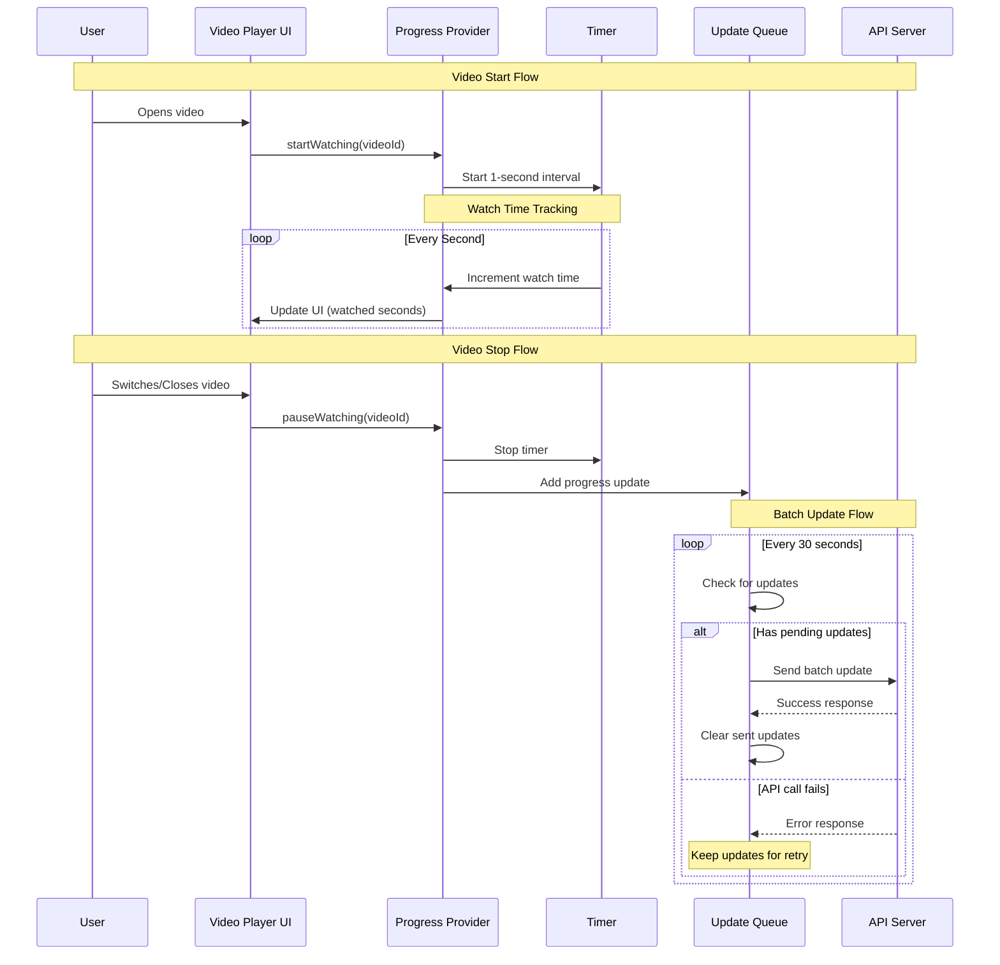

# How to Update Views on Mobile App

This documentation explains the architecture and flow for tracking video views and watch time in a mobile application.

## Architecture Overview

The system uses a batched approach to track video views and watch time efficiently, optimizing for both battery life and network usage.

## Sequence Flow

## Flow Description

### 1. Video Start Flow
- User opens a video in the app
- Video Player UI notifies the Progress Provider
- Provider starts a timer to track watch time

### 2. Watch Time Tracking
- Timer increments watch time every second
- UI is updated to reflect current watch duration
- This continues until the video is stopped or switched

### 3. Video Stop Flow
- User either closes or switches to another video
- Timer is stopped
- Current progress is added to update queue

### 4. Batch Update Flow
- Every 30 seconds, the system checks for pending updates
- If updates exist:
  - Sends batch update to API
  - On success: Clears sent updates
  - On failure: Retains updates for retry

## Key Features

- **Batched Updates**: Reduces API calls by grouping updates
- **Offline Support**: Queues updates when offline
- **Error Handling**: Retries failed updates
- **Battery Efficient**: Optimized timer usage
- **Real-time UI**: Immediate feedback to users

## Implementation Considerations

1. **Network Efficiency**
   - Updates are batched every 30 seconds
   - Reduces API calls and battery usage
   - Handles offline scenarios gracefully

2. **State Management**
   - Maintains watch state locally
   - Synchronizes with server periodically
   - Preserves user progress across sessions

3. **Error Handling**
   - Failed updates are retained for retry
   - Ensures no watch time data is lost
   - Handles network interruptions gracefully

## Best Practices

1. **Timer Management**
   - Start timer only when video is playing
   - Stop timer when video is paused/closed
   - Clean up timers when component unmounts

2. **Queue Management**
   - Regular cleanup of processed updates
   - Persistence for offline scenarios
   - Batch size optimization

3. **API Integration**
   - Implement retry mechanism
   - Handle rate limiting
   - Validate data before sending

## Related Documentation

- API Endpoints Documentation
- Mobile App Architecture Guide
- Error Handling Guidelines
