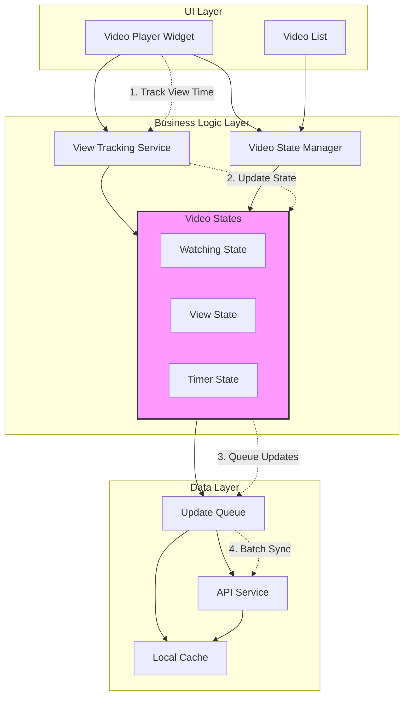

# Video View Tracking System Architecture

## Overview
This document outlines the architecture for implementing video view tracking in a TikTok-style mobile application. The system handles view counting, watch time tracking, and server synchronization efficiently.

## Architecture Diagram



## System Components

### 1. UI Layer
- **Video Player Widget**: Handles video playback and user interactions
- **Video List**: Manages the list/feed of videos

### 2. Business Logic Layer
- **View Tracking Service**: 
  - Tracks watch time
  - Manages view state
  - Handles background/foreground transitions
- **Video State Manager**:
  - Maintains video states
  - Coordinates between UI and data layer
- **States**:
  - Watching State: Tracks current viewing status
  - View State: Manages view counts
  - Timer State: Handles timing logic

### 3. Data Layer
- **Local Cache**: Stores view states and pending updates
- **API Service**: Handles communication with backend
- **Update Queue**: Manages batched updates to server

## Data Flow

1. **View Time Tracking**
   - User watches video
   - Timer tracks watch duration
   - State updates locally

2. **View State Management**
   - Video marked as viewed after threshold (5s)
   - State stored locally
   - Updates queued for sync

3. **Server Synchronization**
   ```json
   {
     "post_id": 1,
     "watched_time": "5"  // Time in seconds
   }
   ```

## Key Features

1. **Efficient State Management**
   - Local state tracking
   - Background handling
   - Memory efficient

2. **Optimized Network Usage**
   - Batched updates
   - Retry mechanism
   - Offline support

3. **Battery Optimization**
   - Smart timer management
   - Background pause
   - Efficient state updates

## Implementation Guidelines

### Video Player Integration
```dart
TikTokStyleVideoPlayer(
  postId: '1',
  videoUrl: 'video_url'
)
```

### State Management
- Initialize tracking service
- Handle lifecycle events
- Manage background states

### API Integration
- Configure base URL
- Handle authentication
- Manage error states

## Error Handling

1. **Network Errors**
   - Queue updates
   - Implement retry logic
   - Maintain consistency

2. **State Recovery**
   - Persist local state
   - Handle app crashes
   - Sync reconciliation

## Performance Considerations

1. **Memory Management**
   - Clear old states
   - Optimize storage
   - Handle large lists

2. **Battery Usage**
   - Efficient timers
   - Background optimization
   - State cleanup

## Security Considerations

1. **Data Integrity**
   - Validate timestamps
   - Secure transmission
   - Auth handling

2. **Abuse Prevention**
   - Rate limiting
   - View validation
   - Fraud detection
